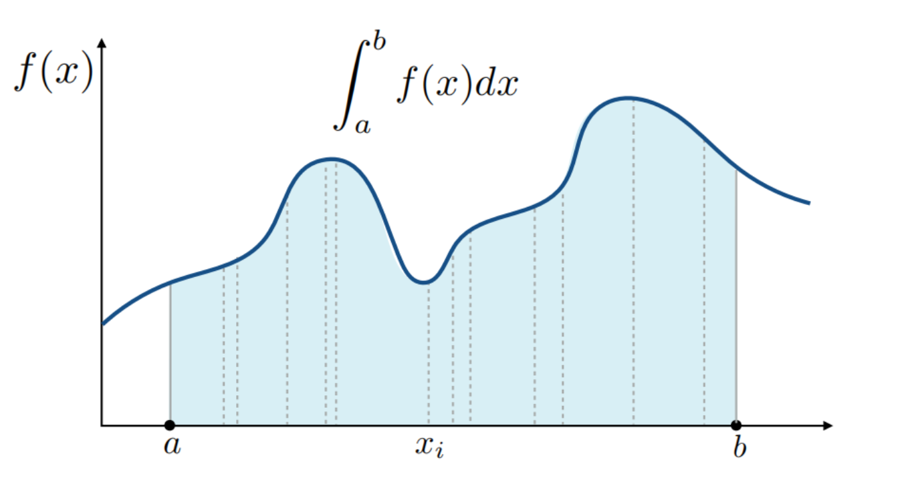
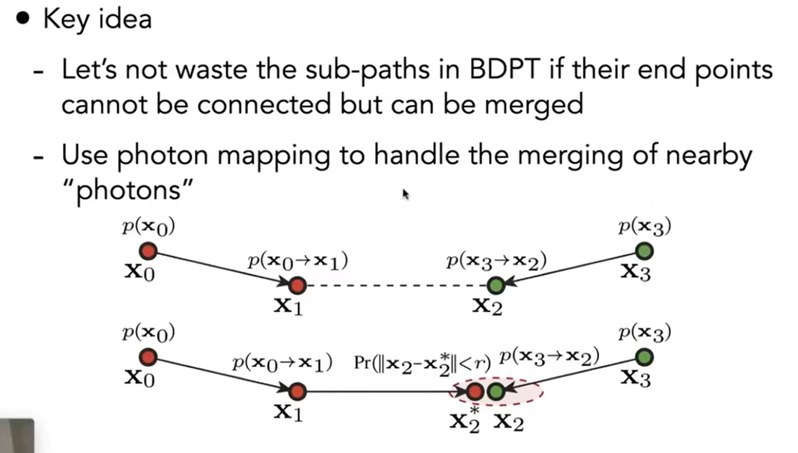
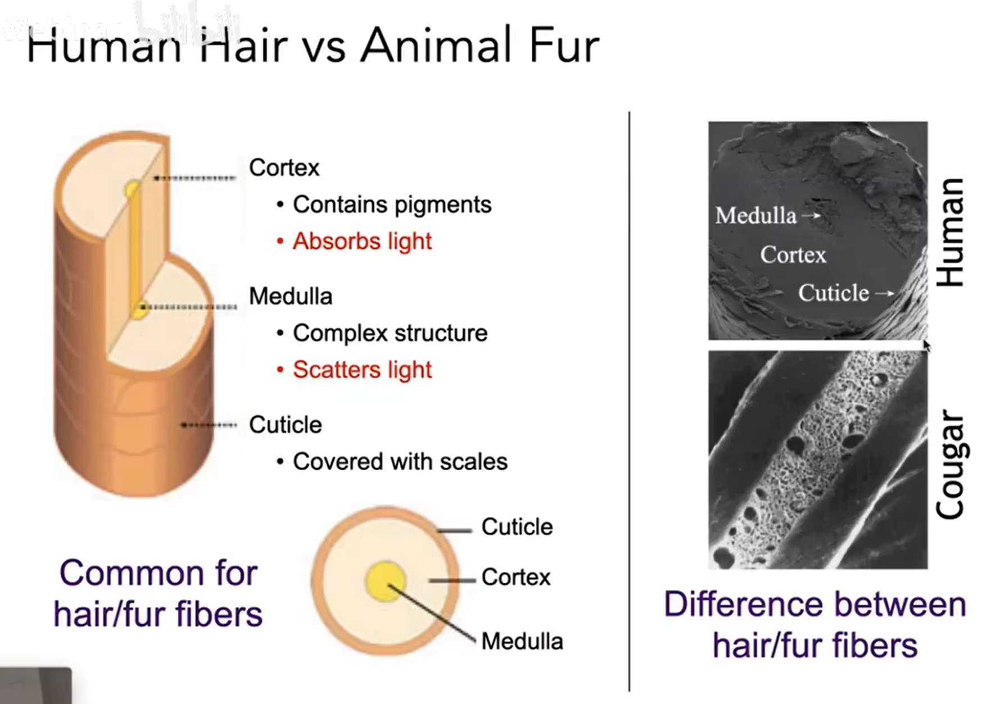
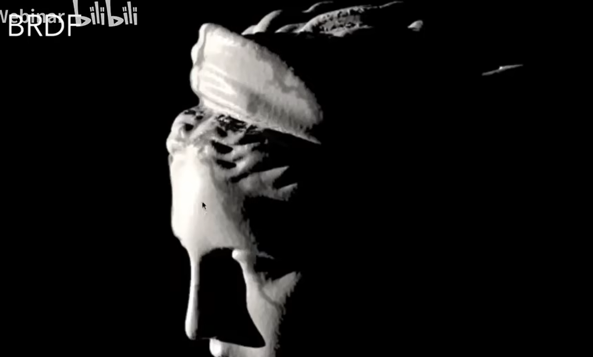
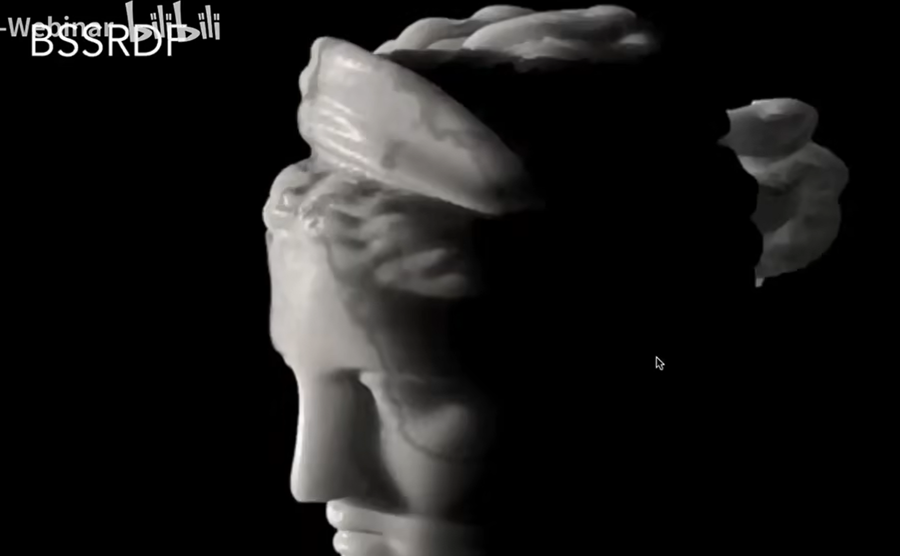

# 无偏估计
## 双向路径追踪
同时从摄像机与光源射出光线

## 黎曼积分与蒙特卡洛积分
黎曼积分是对x轴区域的不断细分，将细分后的区域近似地当作长方形进行计算求和。
由于黎曼积分的性质，我们可以通过推导函数的原函数，求解原函数在x区间上的值来得到函数的积分。

但对于复杂的函数，原函数的推导十分不易。

蒙特卡洛积分的思想是，通过在积分区域内进行多次随机采样，将采样点的值求平均，再将平均值乘上x区间，得到积分的近似值。这很好的规避了复杂函数的原函数推导。

Malkv chain

## MLT Metroplis Light Transform
MLT通过马尔科夫链生成下一个采样点的位置（下一条光线的位置）

S-D-S渲染的困难
Specular -> Diffuse -> Specular 传统的path-tracing算法难以寻找到有效的光路

缺点是收敛具有不确定性
所有的操作都是局部的 ？ 

# 有偏估计
## 光子映射
通过发射光子，正常的进行散射，最后打到diffuse表面上停止，记录这些光子的位置，然后计算光子的密度分布，密度越高的着色点越亮，计算方法是找着色点周围的最近的N个光子，计算N个光子构成的区域的面积，N/区域面积即为该着色点的光子密度分布

光子映射是有偏的，这来自于样本数量的不足，光子的密度分布理想情况应该是单位面积上的光子数，而非一个周围面积上的光子数做平均。因此产出的图片比较blurry。

N get larger, the result will come from noisy to blurry then accurate.
这是一致性的方法，如果给的光子足够多，那确实可以做到准确。

biased = blurry
consistent = not blurry with infinite samples

为什么不选择固定区域？因为选定了固定区域之后，当给出了越来越多的光子，你会发现，固定区域的光子数肯定会增加，而理想情况是光子密度应当收敛至某个值，这显然是不对的。

## VCM vertex connection and merging 
VCM结合了BDPT和Photon Mapping的优点，通过对光子的连接和合并，来提高光子映射的精度。 ?

## Instant Radiosity (Many lights rendering)
将反射点视作一个VPL（virtual point light）来进行渲染，通过计算每个点的入射光线，来计算出每个点的颜色。

## 非表面模型
fog
甚至是人体

使用Phase function 来决定光在介质粒子上如何散射

Marschner模型 用来模拟光与头发的交互 + 多次散射

double cylinder model 双圆柱模型

granular material 粒子状材料 仍然是难点

translucent 光从一端钻入，再从多个方向钻出

BSSRDF 次表面散射

diapole

## 布料模拟
- 当作正常表面，根据编址方式的不同，给出不同的BRDF
- 当作散射介质进行渲染（类似云烟的渲染）
- 根据fiber来渲染 （类似头发的渲染）

## 细节模拟
对于微表面模型，使用更为随机和锯齿状的NDF（Normal Distribution Function），可以得到更加贴近真实的渲染效果（模拟刮擦）

## BRDF的问题
BRDF的采样比较随机，光线很有可能打不到光源或者是摄像机，因此可以扩大采样的范围，比如对于一个像素范围进行采样，而不是像传统的BRDF一样，只在一个方向上进行采样。

对于范围采样得到的NDF被称作p-NDF，p-NDF会随着采样范围的变大而发生很明显的变化

## 光的波动性，对于微小粒子的散射渲染
引入对光的干涉现象的考虑，从而得到不一样的BRDF，更好的去模拟微表面。

## 程序化生成
利用噪声来生成材质
