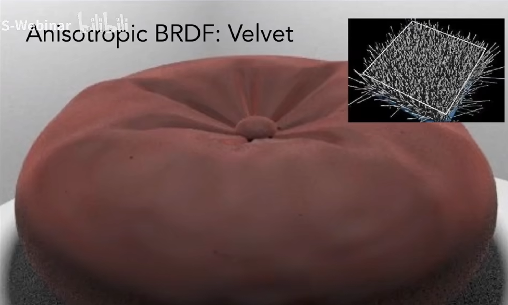
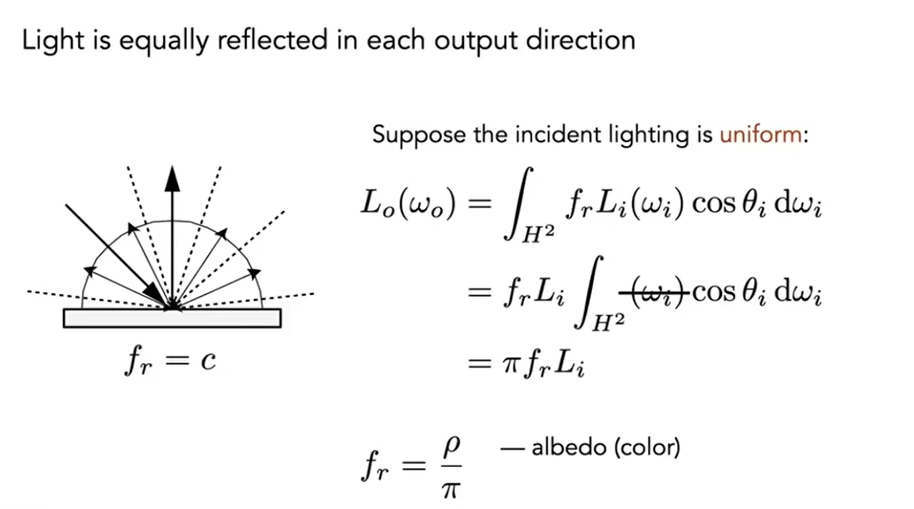
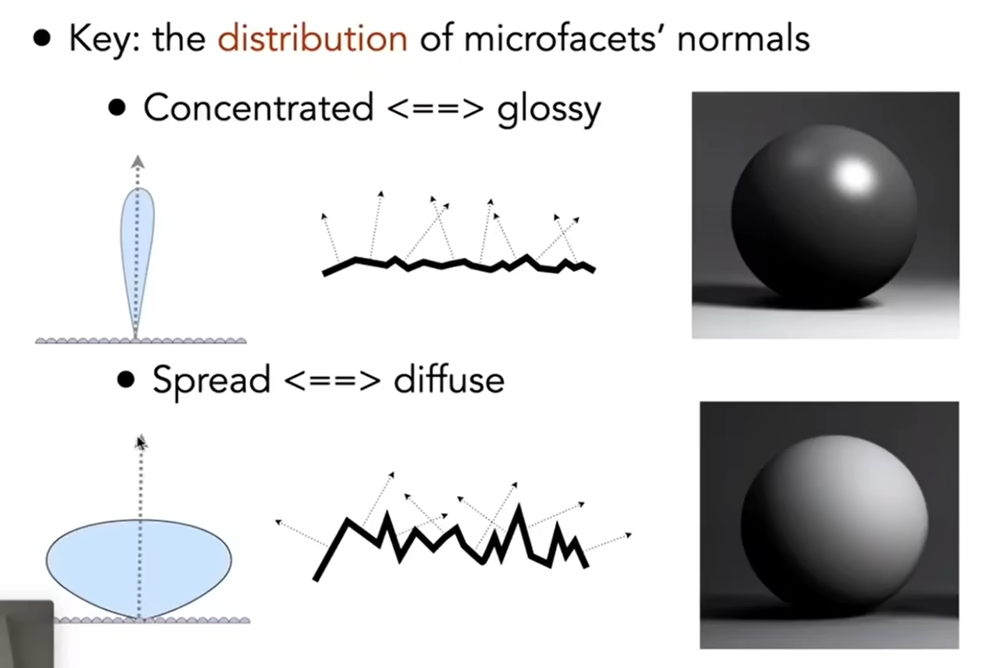
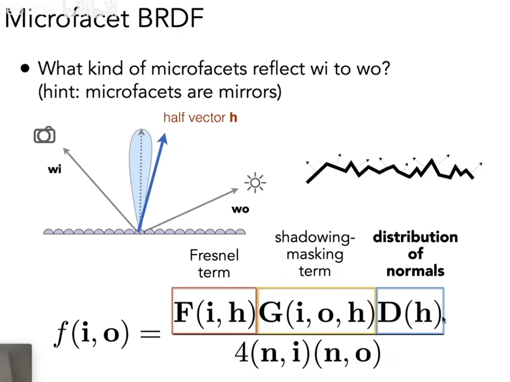
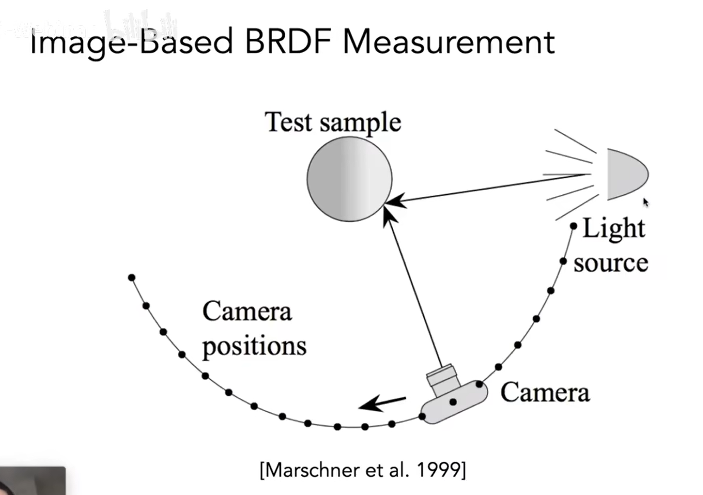

# 材质

> 散射是一种物理现象，指的是波（如光波、声波）或粒子在遇到障碍物或介质不均匀性时，从原始传播方向偏离的现象。当波或粒子与物质相互作用时，它们可能会改变方向，并以多个方向传播出去，而不是按照原来的直线路径前进。散射可以发生在各种尺度上，从宏观到微观，包括分子、原子甚至更小的粒子。

> 比如天空呈现蓝色,是因为瑞利散射（Rayleigh Scattering），它发生在散射体长度小于光的波长时，这种散射强度与波长的四次方成反比，因此短波长（如蓝光）比长波长（如红光）散射得更强烈。

之前的课程涉及的光线散射模型基本都采用的是最简单的宏观模型，实际上自然界中有不少独特的光学现象都是这种模型无法描述的，比如瑞利散射、次表面散射等等，自然界中,发生这些现象的原因来自微观层面(images/如蝴蝶翅膀的颜色实际上是成千上万个微小鳞片的层叠所表现出来的,一个小点内就有大量的反射折射;又或者是因为光的波动性),而在图形学中,我们其实并不需要考虑太细节的部分,可以仍然从宏观出发,将这些现象发生的原因简单地归结为物体表面材质的特殊性。

> 天鹅绒材质的模拟，我们并不需要考虑每根天鹅绒的朝向，而是用一个平均的朝向 + 天鹅绒的反射率来模拟一个单位表面的天鹅绒材质。

比如对于之前的模型中的核心部分——BRDF，计算公式如下：

那么想要对材质进行模拟，只需要改变albedo项即可。

真实感渲染却不止如此。

我们注意到，光学中的概念菲涅尔方程描述了观察角度和表面反射强度的关系，以及微表面模型说明了材质表面的法线分布是是由微观的表面形状起伏所决定的。

另外，微表面模型还说明了一种情况的存在——shadow-masking，即在光线投射到微表面时，由于微表面本身的形状和光线的相互作用，导致某些部分的光线被遮挡，而另一些部分的光线被反射到其他位置。因此在能量计算上，我们需要引入该系数。

为什么模拟Costics对于光线追踪是一个困难?

Snell Window/ Circle - 97.2 degree

brdf - Bidirectional reflectance distribution function
btdf - Bidirectional transmittance distribution function
统称为 bsdf(bidirectional scattering distribution function)

菲涅尔项
绝缘体和导体的菲涅尔项有很大的不同

BRDF的特点
- 非负性
- 线性可加
- 光路可逆性 (r,i互换值仍然相同)
- 能量守恒 (<=1)

测量BRDF，使用物理模型的计算方法总归还是不准确的

MERL BRDF Database

