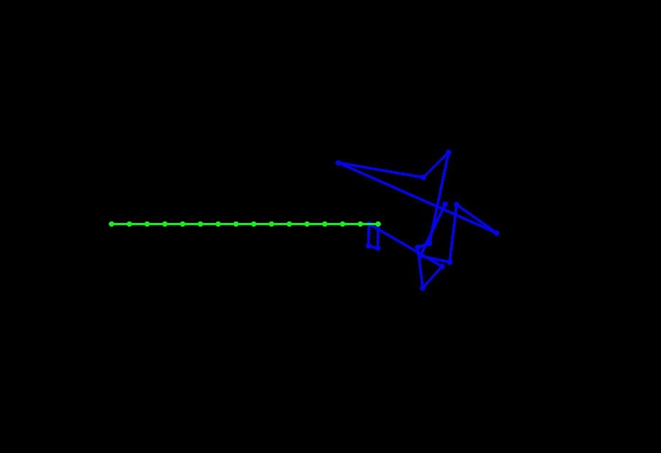
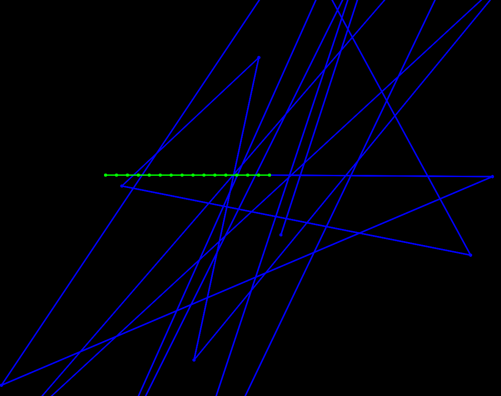
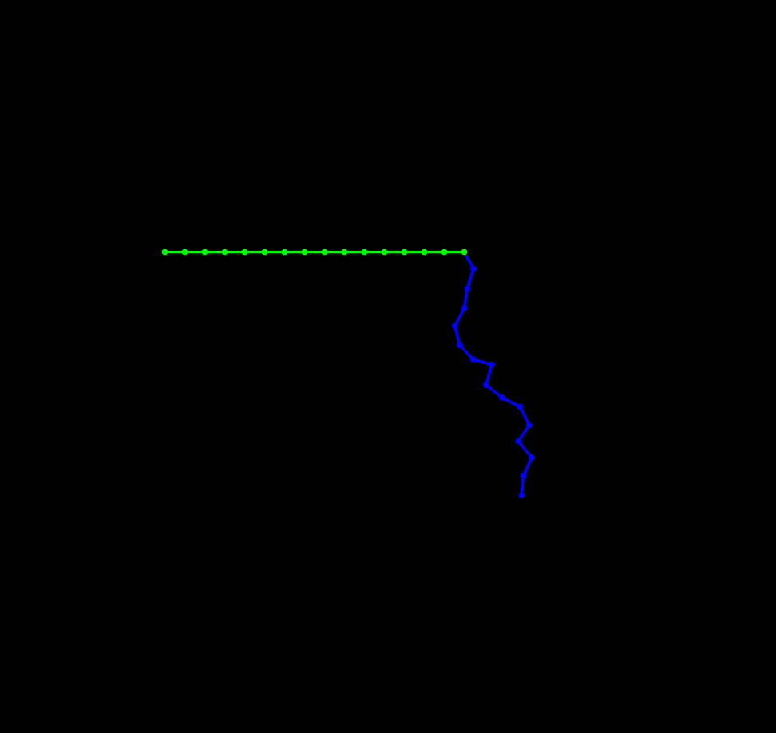

## The position of the masses
the resource give us two method to implement the position of the masses:
1. Explicit Euler method (take the last frame velocity)
2. Semi-implicit Euler method (take the current frame velocity)

but after apply both methods, I find that the Explicit Euler method could lead to a bug (the masses' velocity will be scaled up continuously) while the Semi-implicit Euler method could make the simulation a stable system.

| Explicit Euler | Semi-implicit Euler |
| --- | --- |
| velocity scale up | stable |
| ||

