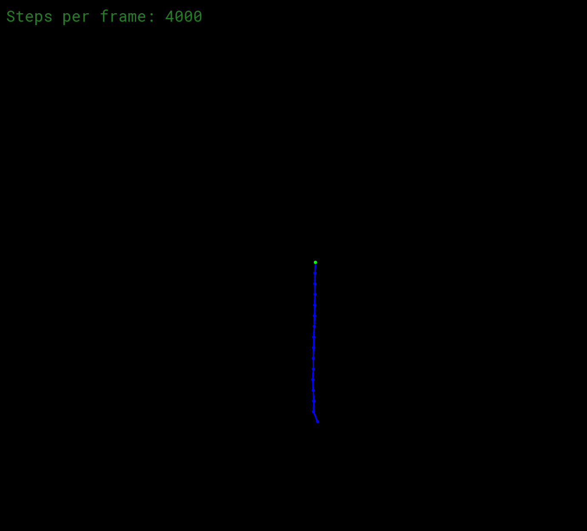
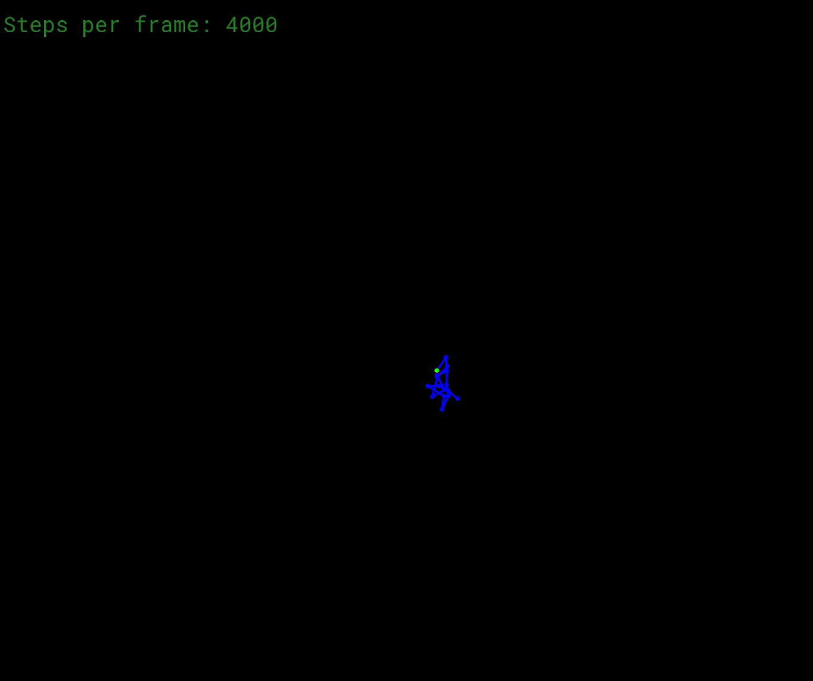
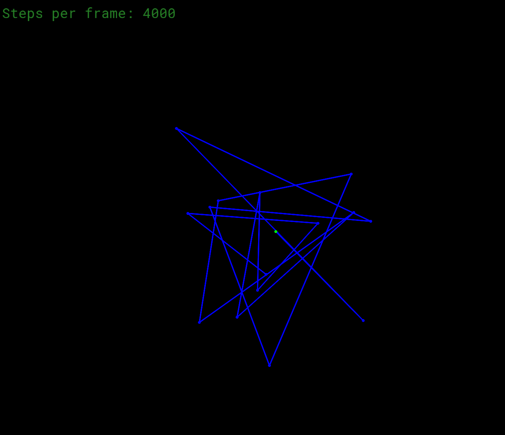
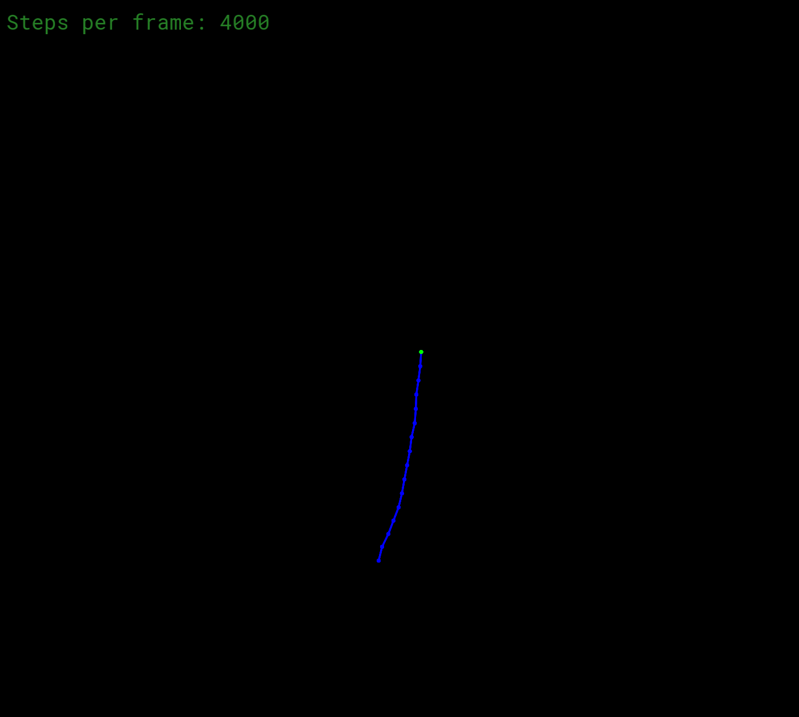

## The position of the masses
the resource give us two method to implement the position of the masses:
1. Explicit Euler method (take the last frame velocity)
2. Semi-implicit Euler method (take the current frame velocity)

but after applying both methods, I find that the Explicit Euler method is unstable (the masses' velocity suddenly increase after a state of closing to stillness, and become faster and faster) while the Semi-implicit Euler method could make the simulation a stable system.

| Explicit Euler | Semi-implicit Euler |
| --- | --- |
| velocity scale up | stable |
|  | |

and in low steps per frame, the explicit Euler method becomes much more unstable while the semi-implicit Euler method still performs well.

